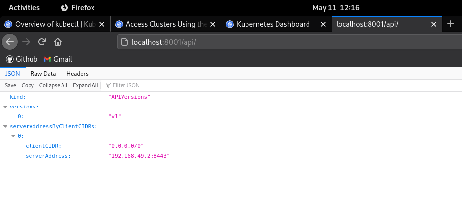
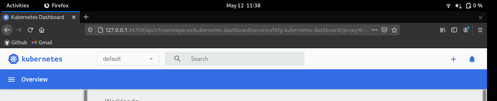
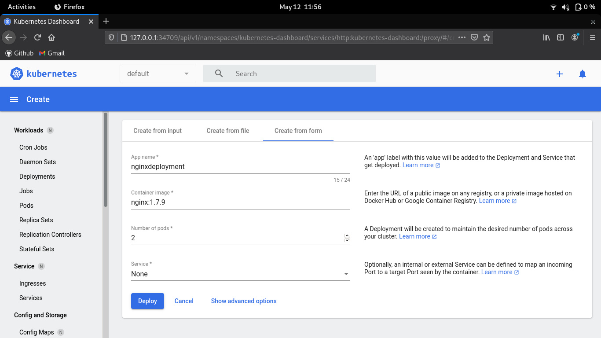

Project HISX2 2020-2021 Kubernetes

# Kubernetes

## Índex

- [Introducció](#introducció)
	* [Què és Kubernetes](#què-és-kubernetes)
	* [Per què utilitzar contenidors?](#per-què-utilitzar-contenidors)
- [Arquitectura de Kubernetes](#arquitectura-de-kubernetes)
	* [Pods](#pods)
	* [Nodes](#nodes)
	* [Clúster](#clúster)
- [Components de Kubernetes](#components-de-kubernetes)
	* [Components del máster](#components-del-master)
		+ [Servidor de API](#servidor-de-api)
		+ [Etcd](#etcd)
		+ [Planificador (Scheduler)](#planificador-(scheduler))
		+ [Gestor de controladors (Controller-manager)](#gestor-de-controladors-(controller---manager))
	* [Components dels nodes](#components-dels-nodes)
		+ [Kubelet](#kubelet)
  		+ [Kube-proxy](#kube---proxy)
		+ [cAdvisor](#cadvisor)
	* [Complements dels nodes](#complements-dels-nodes)
- [Etiquetes](#etiquetes)
	* [Selectors d'etiquetes (labels)](#selectors-d'etiquetes-(labels))
	* [Tipus de selectors](#tipus-de-selectors)
- [Espai de noms (namespaces)](#espai-de-noms-(namespaces))
- [Objectes controladors](#objectes-controladors)
	* [Deployment](#deployment)
	* [ReplicaSet](#replicaset)
- [Emmagatzematge](#emmagatzematge)
	* [Volums](#volums)
	* [Volums persistents](#volums-persistents)
	* [Volums de proveïdors de núvol](#volums-de-proveïdors-de-núvol)
- [Serveis](#serveis)
	* [Tipus de serveis](#tipus-de-serveis)
- [Networking](#networking)
- [Configuració i instal·lació de Kubernetes](#configuració-i-instal·lació-de-kubernetes)
	* [Docker Engine](#docker-engine)
	* [Minikube](#minikube)
	* [Kubectl](#kubectl)
- [Accés al clúster](#accés-al-clúster)
	* [Kubectl](#kubectl)
	* [Dashboard](#dashboard)
	* [API server](#api-server)
- [Creació d'un pod](#creació-d'un-pod)
- [Creació d'un replicaset](#creació-d'un-replicaset)
- [Creació d'un deployment](#creació-d'un-deployment)
	* [Creació amb comandes](#creació-amb-comandes)
	* [Creació amb dashboard](#creació-amb-dashboard)
- [Conclusions](#conclusions)
- [Webgrafia](#webgrafia)

## Introducció

### Què és Kubernetes?

Kubernetes és una plataforma portable i extensible de codi obert per a administrar càrregues de treball i serveis. Kubernetes facilita l'automatització i la configuració declarativa. Té un ecosistema gran i en ràpid creixement. El suport, les eines i els serveis per a Kubernetes estan àmpliament disponibles.

Google va alliberar el projecte Kubernetes l'any 2014. Kubernetes es basa en l'experiència de Google corrent aplicacions en producció a gran durant dècada i mitja, al costat de les millors idees i pràctiques de la comunitat.


### Per què utilizar contenidors?

Kubernetes ofereix un entorn d'administració centrat en contenidors.


*La Manera Antiga* de desplegar aplicacions era instal·lar-les en un servidor usant l'administrador de paquets del sistema operatiu. El desavantatge era que els executables, la configuració, les llibreries i el cicle de vida de tots aquests components s'entreteixien els uns als altres. Podíem construir imatges de màquina virtual immutables per a tenir rollouts i rollbacks predictibles, però les màquines virtuals són pesades i poc portables.

*La Manera Nova* és desplegar contenidors basats en virtualització a nivell del sistema operatiu, en comptes del maquinari. Aquests contenidors estan aïllats entre ells i amb el servidor amfitrió: tenen els seus propis sistemes d'arxius, no veuen els processos dels altres i l'ús de recursos pot ser limitat. Són més fàcils de construir que una màquina virtual, i perquè no estan acoblats a la infraestructura i sistema d'arxius de l'amfitrió, poden emportar-se entre núvols i distribucions de sistema operatiu.


En resum, els beneficis d'usar contenidors inclouen:

- **Àgil creació i desplegament d'aplicacions:** Major facilitat i eficiència en crear imatges de contenidor en comptes de màquines virtuals.
- **Desenvolupament, integració i desplegament continu:** Permet que la imatge de contenidor es construeixi i desplegament de manera freqüent i de confiança, facilitant els rollbacks perquè la imatge és immutable.
- **Separació de tasques entre Dev i Ops:** Pots crear imatges de contenidor al moment de compilar i no en desplegar, desacoblant l'aplicació de la infraestructura.
- **Observabilitat:** No solament es presenta la informació i mètriques del sistema operatiu, sinó la salut de l'aplicació i altres senyals.
- **Consistència entre els entorns de desenvolupament, proves i producció:** L'aplicació funciona igual en un laptop i en el núvol.
- **Portabilitat entre núvols i distribucions:** Funciona en Ubuntu, RHEL, CoreOS, el teu datacenter físic, Google Kubernetes Engine i tota la resta.
- **Administració centrada en l'aplicació:** Eleva el nivell d'abstracció del sistema operatiu i el maquinari virtualizado a l'aplicació que funciona en un sistema amb recursos lògics.
- **Microserveis distribuïts, elàstics, alliberats i feblement acoblats:** Les aplicacions se separen en peces petites i independents que poden ser desplegades i administrades de manera dinàmica, i no com una aplicació monolítica que opera en una sola màquina de gran capacitat.
- **Aïllament de recursos:** Fa el rendiment de l'aplicació més predictible.
- **Utilització de recursos:** Permet major eficiència i densitat.

## Arquitectura de Kubernetes
Kubernetes distribueix els contenidors en **pods**, així aquests poden estar en diversos **nodes**. Al seu torn, aquests nodes formen un **clúster**, completant així l'estructura que té Kubernetes.

### Pods
En Kubernetes els contenidors s'agrupen en pods, per la qual cosa tots els contenidors que s'executin en un pod ho faran en la mateixa màquina o host, ja que no es poden separar.

S'agrupen en el mateix pod contenidors que usen i necessiten els mateixos recursos. D'aquesta manera dóna la sensació que formen un host lògic dins del clúster, per la qual cosa és més fàcil entendre que el pod tindrà una adreça IP compartida pels contenidors que el formaran. A més, tots els pods s'aconseguiran entre ells, atès que compartiran la mateixa xarxa privada.

### Nodes

Les aplicacions que s'executin en el clúster (conjunt de nodes), realment s'estan executant en els nodes, sent els contenidors distribuïts per Kubernetes de manera automàtica.

Aquests nodes poden ser tant un ordinador, com una màquina virtual o fins i tot una màquina en el núvol. Aquests estan administrats per un component anomenat Kubelet, que veurem més endavant.

Els nodes poden ser de dos tipus: els nodes treballadors i els nodes mestres. La diferència que existeix és que els nodes mestres Kubernetes els utilitza per a labors d'administració i planificació dels pods que s'executen en els nodes treballadors del clúster. Aquesta administració i control es realitza a través de diferents controladors que veurem més endavant.

Normalment es disposa d'un únic node màster, però en funció de la càrrega de treball, podríem disposar de diversos nodes màster, fent així el sistema més resistent davant fallades.

### Clúster

Un clúster es forma pels dos elements explicats anteriorment. Kubernetes coordina contenidors en un sistema format per diversos nodes, fent que tot funcioni com una sola unitat regida pel node màster, aconseguint que les aplicacions no estiguin vinculades a una sola màquina o host. Això evita que hàgim d'instal·lar una aplicació directament en una sola màquina, ja que la realitzem sobre el clúster.

Finalment, la comunicació dels nodes amb el màster i de l'usuari amb el clúster, es fa a través de la API de Kubernetes.

## Components de Kubernetes

Perquè l'arquitectura descrita abans funcioni correctament, Kubernetes utilitza diversos components en els diferents elements del seu sistema.

### Components del máster

**Servidor de API**

Serveix per a accedir a la API de Kubernetes en el nostre clúster. És el front-end del pla de control de Kubernetes, és a dir, és on arriben les peticions al clúster. Aquestes poden arribar des d'un node o des d'una petició per part de l'administrador del màster, i el redirigeix als components que corresponguin.

Bàsicament s'encarrega de preparar, validant i configurant, les dades dels objectes api que necessitem per al clúster. També prepara la interfície a través la qual els components del clúster interactuen amb els altres components.

**Etcd**

És una base de dades que guarda i emmagatzema la configuració del clúster, emmagatzemant també informació dels serveis que estan disponibles.

Etcd estarà replicant en tots els nodes màster del clúster per a assegurar una alta disponibilitat de la informació. Aquesta informació és també usada pel API server perquè els serveis desplegats en els contenidors mantinguin les seves característiques.

**Planificador (Scheduler)**

Assigna als nous pods un node en el qual executar-se, és a dir, s'encarrega de repartir els recursos disponibles en el clúster, per a l'execució dels pods després de valorar els requisits que necessiten per a desenvolupar el seu treball.

També és el responsable de monitorar la utilització de recursos de cada host per a assegurar que els pods no sobrepassin els recursos disponibles una vegada ja estiguin en funcionament.

**Gestor de controladors (Controller-manager)**

És un component que, com el seu nom indica, s'encarrega de gestionar els controladors dels nodes. Aquests controladors són els següents:

* Controlador de rèpliques (replication controller): S'encarrega de controlar l'execució correcta de rèpliques desitjades per a una aplicació.

* Controlador del node (node controller): S'encarrega de controlar que els nodes pertanyents a un clúster funcionen de manera correcta i detectar si un node ha deixat de fucionar.

* Controlador de punts finals (end-*points controller): Gestiona els punts finals (end-*points) dels serveis desplegats.

* Controlador del núvol: És un controlador de les últimes versions de Kubernetes que gestiona la connexió amb el proveïdor de serveis en el núvol que es contracta per al nostre clúster.

### Components dels nodes

**Kubelet**

S'executa en cada node gestionant els pods i el seu contingut a través dels fitxers que descriuen cada pod, i junts formen les especificacions d'un pod.

Cal tenir en compte que Kubelet no administra contenidors que no pertanyen a Kubernetes, és a dir, que no hagin estat creats per Kubernetes.

**Kube-proxy**

S'executa en cada node i proporciona abstracció de serveis en realitzar la reexpedició de connexió. Així, quan arriba una petició de servei a un node per part d'un usuari des de l'exterior, a un node on no s'està executant algun pod de l'aplicació que s'encarrega d'ells, kube-proxy s'ocupa de fer que la connexió es reencíe al node correcte.

**cAdvisor**

Es dedica a recollir informació de l'ús dels recursos que s'usen en els nodes vigilant la CPU, la memòria, sistemes de fitxers i l'ús de la xarxa. La informació recollida s'usa per a informar el node mestre.

### Complements dels nodes

Els complements doten a l'estructura del clúster de funcionalitats addicionals, que encara no està disponibles per defecte en Kubernetes, però que es poden implementar a través de tercers:

* DNS: Malgrat ser un complement, la seva funcionalitat és necessària per al correcte funcionament del clúster. Serà usat per kube-proxy, per a reexpedir la informació.

* Dashboard: Una interfície web destinada a l'usuari amb finalitats d'administració del clúster.

En la següent imatge es mostra l'estructura completa de l'arquitectura amb els components en cada element del clúster.


## Etiquetes

Estan definides en els objectes i són una dupla de clau i valor separats per dos punts, és a dir, amb la forma "clau:valor". S'usen per a la gestió dels objectes per part dels controladors del clúster.

Cal tenir en compte que una etiqueta ha de ser única en un objecte però pot tenir diversos valors, fins i tot estar buit.

En l'objecte les etiquetes s'organitzen a continuació de l'etiqueta "labels" de les metadades.

```
"metadata": {
  "labels": {
    "key1" : "value1",
    "key2" : "value2"
  }
}
```

Les etiquetes no estan prèviament definides, podent cada desenvolupador establir els noms que més convinguin.

### Selectors d'etiquetes (labels)

Abans s'ha vist que no poden existir dues etiquetes amb el mateix nom en un objecte, però si pot haver-hi dos objectes amb la mateixa etiqueta i el mateix valor. Això fa possible agrupar un conjunt d'objectes, en funció d'una etiqueta, usant els selectors d'etiquetes i comprovant els valors que aquestes tenen. Per exemple, s'utilitza per a executar pods per a prestar un servei en el sistema.

### Tipus de selectors

* Selectors d'igualtat: Busca igualtats que compleixin la condició especificada en l'operador definit de l'expressió implementada.

```
1. app = server
2. app != zone1
```

El primer selecciona objectes que tenen l'etiqueta "app" i el valor "server", i el segon exemple exclou els objectes que tinguin el valor "zone1".

* Selectors de conjunt: Aquest tipus de selectors busca que una etiqueta tingui un valor que satisfà un rang d'opcions, és a dir, no hi ha una condició específica de selecció com en els selectors d'igualtat.

```
1. type in (server, client1)
2. zone notin (zone1, zone2)
```

El primer exemple selecciona els objectes que tenen l'etiqueta "type" amb els valors "server" i "client1". El segon exemple selecciona els objectes que no tinguin el valor "zone1", "zone2" i "zone3". Com es veu en tots dos exemples, pot haver-hi diversos valors per a configurar la regla del selector.

* Selectors de clau: Aquests selectors només comproven l'existència d'una etiqueta, sense importar el valor que té.

```
1. app
2. type
3. !zone
```

Els dos primers exemples seleccionen els objectes que tinguin l'etiqueta, mentre que el tercer exemple exclou als objectes que continguin l'etiqueta "zone". Com no importa el valor de les etiquetes, no s'implementen en la regla, és més una condició d'existència.

## Espai de noms (namespaces)

L'espai de noms serveix per a dividir el clúster físic de manera virtual, de manera que podria dir-se que crea clústers virtuals. A més, aquesta divisió lògica crea aïllaments de noms entre els objectes de diferents espais de noms. Per exemple, podríem tenir un pod en un node amb un nom, i en el mateix node, però en un namespace diferent altre pod amb el mateix nom.

Quan es crea un clúster de Kubernetes, es creen per defecte tres namespaces en el sistema:

* Default: Quan es creen objectes als quals no se li ha especificat un espai de noms concret se li assigna el namespace "default".

* Kube-system: Kubernetes necessita objectes per a funcionar i exercir el seu treball. Aquests objectes es creen en aquest espai de noms.

* Kube-public: Com el seu nom indica és públic i per tant tots els usuaris poden accedir al seu contingut. Pot ser un espai que estigui buit o que contingui informació pública que interessi mostrar.

Addicionalment, a aquests tres espais de noms, es poden crear nous espais per a dividir el sistema de manera convenient. Per exemple, crear un espai de noms dedicat a proves de les aplicacions que vulguem testar prèviament.

## Objectes controladors

Existeixen objectes dels controladors encarregats que el clúster funcioni correctament perquè pugui gestionar els pods i, per tant, la orquestració de contenidors.

### Deployment

És el controlador de desplegaments de contenidors que necessitem per a la nostra aplicació. S'encarrega que aquesta s'executi sobre la base d'unes característiques específiques. Per exemple, el número de pods que volem que s'executin.

### ReplicaSet

És un controlador de rèpliques de pods de l'aplicació desplegada. Aquestes quantitats específiques de rèpliques es vigilen i, en cas que no es compleixin, ReplicaSet s'encarrega de recuperar l'estat desitjat del nombre de rèpliques. Per exemple, si hem especificat que volem tres rèpliques d'un pod i un dels nodes del clúster deixa de funcionar, ReplicaSet s'encarregarà de sol·licitar la creació de nous pods que s'allotjaran en altres nodes per a així continuar mantenint la configuració desitjada.

## Emmagatzematge

Les aplicacions que s'executen en contenidors poden necessitar algun tipus d'emmagatzematge per a la seva correcta execució, ja sigui només durant l'execució o rebent informació del sistema d'emmagatzematge. És per això que Kubernetes utilitza volums capaços d'emmagatzemar dades.

### Volums

Per a aquest emmagatzematge es crea un objecte volum anomenat "volum", que s'executa en el pod i és accessible per tots els contenidors executats en aquest. Però aquest emmagatzematge és temporal, és a dir, la qual cosa s'emmagatzema en un pod només roman durant l'execució del pod. Pel que, si tant un pod com un node que executa aquest pod deixa de funcionar, Kubernetes pot llançar un altre pod per a reposar el servei, però el volum torna a tenir la informació especificada en la configuració de l'aplicació que estem desplegant, no de l'anterior.

* EmptyDir: Munta un volum buit en el pod del contenidor en la ruta especificada en la configuració del contenidor amb l'etiqueta "emptyDir".

### Volums persistents

En canvi, si volem usar emmagatzematge persistent en un pod, s'utilitza un volum de tipus persistent anomenat *persistentVolume*. Aquest tipus de volums carregaran una ruta de la màquina física i amb una petició de volum anomenada *persistentVolumeClaim* es munta en l'ordinador.

Quan es modifica alguna cosa en aquest volum també es modifica en la màquina física. Pel que, si un node es reinicia continua tenint la informació que va modificar.

* HostPath: Munta una ruta del sistema de fitxers del node en la ruta indicada en la configuració del contenidor. Aquesta informació es dóna com a valor de la etquieta "path" que estarà niada sota l'etiqueta "hostPath".

### Volums de proveïdors de núvol

Tant Amazon com Google i altre, disposen dels seus propis sistemes d'emmagatzematge persistent. Aquests volums només es poden usar en els contenidors de la mateixa zona geogràfica, per la qual cosa és important usar mecanismes com els selectors perquè els pods que vulguin usar aquests volums compleixin amb aquest requisit.

* gcePersistentDisk: Munta un volum Google Computi Engine (GCE) persistent disk en un pod.

* awsElasticBlockStore: Munta un volum AWS EBS Volume en un pod.

* azureDisk: Munta un Microsoft Azure Data Disk en un pod.

* azureFile: Munta un Microsoft Azure File Volume en un pod.

## Serveis

Quan l'aplicació ja és desplegada en un clúster és important saber com connectar-se a l'aplicació perquè un client pugui realitzar la petició d'un servei. Els serveis exposen l'aplicació de totes les rèpliques existents de manera unificada, utilitzant etiquetes i selectors.

### Tipus de serveis

* ClusterIP: Defineix el servei assignant una IP interna de clúster, per la qual cosa només es pot accedir al servei des del propi clúster. D'aquesta manera no cal preocupar-se de les variacions de les adreces IP dels nodes del clúster que es puguin donar per substitució de nodes o reassignació d'adreces.

* NodePort: Assigna el mateix port en cada node per a cada servei, així amb NodeIP (IP del node) i NodePort (port assignat per al servei) es pot accedir al servei des de fora del clúster. *Kube-proxy* s'encarregarà de enrutar el trànsit, usant el servei DNS, al node correcte.

Perquè l'usuari que accedeixi als serveis no tingui la necessitat de conèixer totes les adreces IP, es pot crear un balanceador de càrrega extern.

* LoadBalancer: Si usem un proveïdor de serveis en núvol per al nostre clúster de Kubernetes no necessitem crear un balanceador de càrrega, ja que la majoria dels proveïdors tenen plugins per a aquesta tasca. A aquests serveis es denominen de tipus *LoadBalancer* i creen una IP fixa i externa al servei perquè el balanceador s'encarregui d'encaminar el trànsit.

## Networking

Un pod és la unitat més bàsica que ens trobem en l'arquitectura de Kubernetes. Per tant, cada pod té una adreça IP pertanyent a una xarxa privada del clúster. Així els contenidors que pertanyen a un mateix pod comparteixen aquesta adreça IP, sent les connexions diferenciables pels ports que usa cada contenidor. Pel que un end-point, en Kubernetes, fa referència a un pod.

Perquè la connectivitat funcioni correctament en el clúster ha de complir-se:

* Que tots els pods d'un mateix espai de noms puguin arribar a establir comunicació entre ells.
* Que tots els nodes puguin establir comunicació entre ells.
* Que tots els pods puguin establir comunicació amb tots els nodes.

## Configuració i instal·lació de Kubernetes

Per començar a treballar amb Kubernetes instal·larem docker, minikube i kubectl. Hem de tenir en compte que per a que funcioni Minikube i treballi sobre Docker, necessitarem una versió de Docker superior a la versió 18.09. I per utilitzar aquestes versions de Docker, necessitem una versió de 64-bit de Fedora de les versions Fedora 32, Fedora 33 o Fedora 34. És per això que en el meu cas, que disponia de Fedora 27, he hagut d'instal·lar-me un nou Fedora.

### Docker Engine

Docker Engine és una tecnologia de contenidors de codi obert per crear i contenir aplicacions. Docker Engine actua com una aplicació client-servidor. L'utilitzarem per desplegar Minikube.

Instal·lació:

```bash
[adri@localhost kubernetes]$ sudo dnf -y install dnf-plugins-core

[adri@localhost kubernetes]$ sudo dnf config-manager \
    --add-repo \
    https://download.docker.com/linux/fedora/docker-ce.repo

[adri@localhost kubernetes]$ sudo dnf -y install docker-ce
```

Arrancada:

```bash
[adri@localhost kubernetes]$ sudo systemctl start docker
```

### Minikube

Com hem vist abans, Kubernetes necessita com a mínim 3 nodes per funcionar, i es complica massa si només volem fer probes localment. Es per això que es va crear Minikube. Minikube és una versió reduïda de Kubernetes, desplegada en una màquina virtual, que actuarà de master i treballador al mateix temps. 

Descarreguem el paquet i l'instal·lem:

```bash
[adri@localhost kubernetes]$ curl -LO https://storage.googleapis.com/minikube/releases/latest/minikube-linux-amd64
[adri@localhost kubernetes]$ sudo install minikube-linux-amd64 /usr/local/bin/minikube
```

Iniciem el clúster:

```bash
[adri@localhost kubernetes]$ minikube start --driver=docker
```

Podem especificar que funcioni sempre amb docker:

```bash
[adri@localhost kubernetes]$ minikube config set driver docker
```

Un cop terminada l'execució de la ordre, ens recomana instal·lar kubectl.

### Kubectl

Kubectl és el client o interfície de línia de comandes per executar ordres sobre clúster o aplicacions de Kubernetes. Aquesta interfície és la manera estàndard de comunicació amb el clúster ja que permet realitzar tot tipus d'operacions.

Descarreguem el paquet i l'instal·lem:

```bash
[adri@fedora kubernetes]$ curl -LO "https://dl.k8s.io/release/$(curl -L -s https://dl.k8s.io/release/stable.txt)/bin/linux/amd64/kubectl"
[adri@fedora kubernetes]$ sudo install -o root -g root -m 0755 kubectl /usr/local/bin/kubectl
```

Verifiquem la versió instal·lada:

```bash
[adri@fedora kubernetes]$ kubectl version --client
Client Version: version.Info{Major:"1", Minor:"21", GitVersion:"v1.21.0", GitCommit:"cb303e613a121a29364f75cc67d3d580833a7479", GitTreeState:"clean", BuildDate:"2021-04-08T16:31:21Z", GoVersion:"go1.16.1", Compiler:"gc", Platform:"linux/amd64"}
```

Un cop hem iniciat Minikube, podem verificar si kubectl està correctament configurat i vinculat al clúster:

```bash
[adri@fedora kubernetes]$ kubectl cluster-info
Kubernetes control plane is running at https://192.168.49.2:8443
KubeDNS is running at https://192.168.49.2:8443/api/v1/namespaces/kube-system/services/kube-dns:dns/proxy
```

## Accés al clúster

Abans d'accedir al clúster, verifiquem l'estat del mateix:

```bash
[adri@fedora kubernetes]$ minikube status
minikube
type: Control Plane
host: Running
kubelet: Running
apiserver: Running
kubeconfig: Configured
```

Un cop hem vist que el clúster està en funcionament, podem accedir-hi de varies maneres:

### Kubectl 

Com hem esmentat abans, kubectl es el CLI de Kubernetes i l'utilitzarem per administrar els recursos del clúster i les aplicacions. Per veure totes les possibilitats i opcions del client, veure [aquí](https://kubernetes.io/docs/reference/kubectl/overview/)

### Dashboard 

Podem accedir al clúster mitjançant una interfície web amb la següent ordre:

```bash
[adri@fedora kubernetes]$ minikube dashboard
🔌  Enabling dashboard ...
    ▪ Using image kubernetesui/dashboard:v2.1.0
    ▪ Using image kubernetesui/metrics-scraper:v1.0.4
🤔  Verifying dashboard health ...
🚀  Launching proxy ...
🤔  Verifying proxy health ...
🎉  Opening http://127.0.0.1:40833/api/v1/namespaces/kubernetes-dashboard/services/http:kubernetes-dashboard:/proxy/ in your default browser...
```


### API server

Com hem explicat abans a l'apartat de Components de Kubernetes, disposem del servidor API per accedir al nostre clúster. Per connectar-nos utilitzarem kubectl proxy.

Executem el proxy:

```bash
[adri@fedora kubernetes]$ kubectl proxy
Starting to serve on 127.0.0.1:8001
```

Mirem l'API:

```bash
[adri@fedora kubernetes]$ curl http://localhost:8001/api/
{
  "kind": "APIVersions",
  "versions": [
    "v1"
  ],
  "serverAddressByClientCIDRs": [
    {
      "clientCIDR": "0.0.0.0/0",
      "serverAddress": "192.168.49.2:8443"
    }
  ]
}
```



## Creció d'un pod

És la unitat més petita de l'arquitectura de Kubernetes. Com hem explicat abans en l'apartat d'arquitectura, un pod representa un conjunt de contenidors que comparteixen emmagatzematge i una única IP, encara que són efímers.

Fitxer d'exemple d'un pod:

```bash
apiVersion: v1
kind: Pod
metadata:
  name: nginx
  namespace: default
  labels:
    app: nginx
    service: web
spec:
  containers:
    - image: nginx:1.16
      name: nginx
      imagePullPolicy: Always
```

Creem el pod:

```bash
[adri@fedora kubernetes]$ vim pod.yaml
[adri@fedora kubernetes]$ kubectl create -f pod.yaml 
pod/nginx created
[adri@fedora kubernetes]$ kubectl get pods
NAME    READY   STATUS    RESTARTS   AGE
nginx   1/1     Running   0          106s
```

Eliminar el pod:

```bash
[adri@fedora kubernetes]$ kubectl delete -n default pod nginx
pod "nginx" deleted
```

## Creació d'un replicaset

És el recurs de Kubernetes que ens asegura que sempre s'executin el número de répliques que indiquem d'un pod determinat.

Fitxer d'exemple d'un replicaset:

```bash
apiVersion: apps/v1
kind: ReplicaSet
metadata:
  name: nginx
  namespace: default
spec:
  replicas: 2
  selector:
    matchLabels:
      app: nginx
  template:
    metadata:
      labels:
        app: nginx
    spec:
      containers:
        - image:  nginx
          name:  nginx
```

Es crea i s'afegeix:

```bash
[adri@fedora kubernetes]$ vim replicaset.yaml
[adri@fedora kubernetes]$ kubectl create -f replicaset.yaml 
replicaset.apps/nginx created
[adri@fedora kubernetes]$ kubectl get pods
NAME          READY   STATUS    RESTARTS   AGE
nginx         1/1     Running   0          11m
nginx-vvbzc   1/1     Running   0          110s
```

Escalem els pods a 5 rèpliques:

```bash
[adri@fedora kubernetes]$ kubectl scale rs nginx --replicas=5
replicaset.apps/nginx scaled
[adri@fedora kubernetes]$ kubectl get pods -o wide
NAME          READY   STATUS    RESTARTS   AGE     IP           NODE       NOMINATED NODE   READINESS GATES
nginx         1/1     Running   0          15m     172.17.0.5   minikube   <none>           <none>
nginx-45wtb   1/1     Running   0          67s     172.17.0.8   minikube   <none>           <none>
nginx-6jqnd   1/1     Running   0          67s     172.17.0.9   minikube   <none>           <none>
nginx-ppvcb   1/1     Running   0          67s     172.17.0.7   minikube   <none>           <none>
nginx-vvbzc   1/1     Running   0          5m42s   172.17.0.6   minikube   <none>           <none>
```

Ara probarem que el replicaset funciona, eliminarem tots el pods menys el nginx-vvbzc. Veurem com un cop s'eliminen, els substitueix:

```bash
[adri@fedora kubernetes]$ kubectl delete -n default pod nginx-45wtb nginx-6jqnd nginx-ppvcb nginx-vvbzc
pod "nginx-45wtb" deleted
pod "nginx-6jqnd" deleted
pod "nginx-ppvcb" deleted
pod "nginx-vvbzc" deleted
[adri@fedora kubernetes]$ kubectl get pods -o wide
NAME          READY   STATUS    RESTARTS   AGE     IP           NODE       NOMINATED NODE   READINESS GATES
nginx-7kks4   1/1     Running   0          2m55s   172.17.0.8   minikube   <none>           <none>
nginx-kkq47   1/1     Running   0          2m53s   172.17.0.5   minikube   <none>           <none>
nginx-stng7   1/1     Running   0          2m55s   172.17.0.7   minikube   <none>           <none>
nginx-vvbzc   1/1     Running   0          39m     172.17.0.6   minikube   <none>           <none>
nginx-z9glv   1/1     Running   0          2m57s   172.17.0.9   minikube   <none>           <none>
```

## Creació d'un deployment

És la unitat de més alt nivell. Serà el controlador dels desplegaments dels contenidors que necessitem per a la nostra aplicació. Ens permet definir diferentes funcions:

* Control de rèpliques
* Escalabilitat dels pods
* Actualitzacions continues
* Desplegaments automàtics
* Rollback a versions anteriors

Disposem de dues maneres: amb kubectl des de comandes i amb el dashboard.

### Creació amb comandes (kubectl)

Podrem crear el nostre deployment des de la línia de comandes amb kubectl, pero primèrament necessitem crear el fitcher .yaml on es basarà la creació d'aquest.

Per exemple, crearem aquest .yaml bastant sencill, que desplegarà 2 pods:

```bash
apiVersion: apps/v1 
kind: Deployment
metadata:
  name: nginx-deployment
spec:
  selector:
    matchLabels:
      app: nginx
  replicas: 2
  template:
    metadata:
      labels:
        app: nginx
    spec:
      containers:
      - name: nginx
        image: nginx:1.7.9
        ports:
        - containerPort: 80
```

Un cop creat el fitxer, creem el deployment amb kubectl:

```bash
[adri@fedora kubernetes]$ kubectl create -f nginx-deployment.yaml 
deployment.apps/nginx-deployment created
```

Verifiquem:

```bash
[adri@fedora kubernetes]$ kubectl get deployments
NAME               READY   UP-TO-DATE   AVAILABLE   AGE
nginx-deployment   2/2     2            2           3m3s
[adri@fedora kubernetes]$ kubectl get pods
NAME                                READY   STATUS    RESTARTS   AGE
nginx-deployment-5d59d67564-6n2rq   1/1     Running   0          3m8s
nginx-deployment-5d59d67564-6rjmb   1/1     Running   0          3m8s

[adri@fedora kubernetes]$ kubectl get replicasets
NAME                          DESIRED   CURRENT   READY   AGE
nginx-deployment-5d59d67564   2         2         2       3m20s
```

Actualment, els pods están funcionant amb la imatge nginx:1.7.9. Com el deployment ens ho permet, actualitzarem la imatge dels pods a la imatge nginx:latest:

Cambiem la imatge en el fitxer de configuració del deployment i ho verifiquem:

```bash
[adri@fedora kubernetes]$ kubectl get pods nginx-deployment-75b69bd684-t7vzr -o yaml | grep 'image:'
  - image: nginx:latest
    image: nginx:latest
```

Eliminem:

```bash
[adri@fedora kubernetes]$ kubectl delete -n default deployment nginx-deployment
deployment.apps "nginx-deployment" deleted
```

### Creació amb dashboard

Obrim el dashboard:

```bash
[adri@fedora kubernetes]$ minikube dashboard
🤔  Verifying dashboard health ...
🚀  Launching proxy ...
🤔  Verifying proxy health ...
🎉  Opening http://127.0.0.1:34709/api/v1/namespaces/kubernetes-dashboard/services/http:kubernetes-dashboard:/proxy/ in your default browser...
```

Un cop obert, permém el botó +:



Ens dóna tres opcions per a la creació del fitxer del deployment: la primera seria introduir el codi del fitxer en la mateixa web (bàsicament com hem fet abans per crear-lo  en un fitxer), la segona per importar un fitxer ja existent (podríem importar el abans creat) i la tercera s'autogenera segons els paràmetres que l'indiquem. Com ja hem probat abans via comandes les dues primeres opcions, provem aquesta darrera opció:



Un cop premém el botó de deploy, es crea el deployment. Podem visualitzar tota la informació al dashboard.


## Conclusions

És tan gran l'impacte que està tenint Kubernetes en la orquestració i gestió de contenidors, que s'està convertint en l'eina més utilitzada. Actualment es troba en un moment de gran creixement gràcies a la comunitat i al suport per part de Google, Red Hat, Microsoft, Amazon...

Els contenidors han suposat una revolució en la manera de desenvolupar i deplegar aplicacions, pero això no haguès estat posible sense eines com Kubernetes.

## Webgrafia

https://kubernetes.io/
https://minikube.sigs.k8s.io/
https://www.youtube.com/watch?v=X48VuDVv0do
