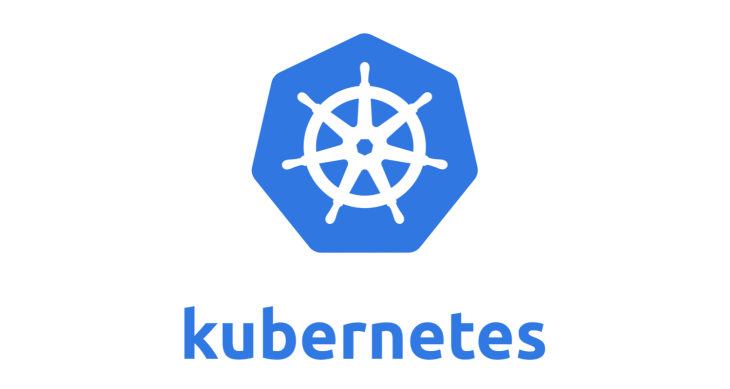
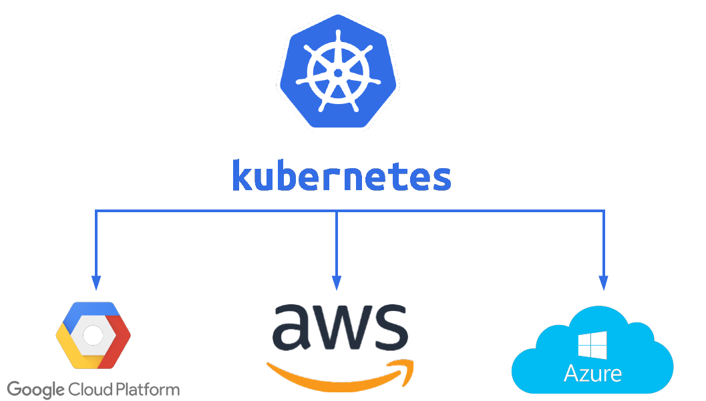

# Kubernetes
## Project HISX2 2020-2021

Adrián Narváez

#
## Introducció
### Què és Kubernetes?
Kubernetes és una plataforma portable i extensible de codi obert per a administrar càrregues de treball i serveis en contenidors.
Google va alliberar el projecte Kubernetes l'any 2014

#
### Contenidors
Kubernetes ofereix un entorn d'administració centrat en contenidors.

#
### Beneficis
En resum, els beneficis d'usar contenidors inclouen:

+ Àgil creació i desplegament d'aplicacions
+ Desenvolupament, integració i desplegament continu
+ Separació de tasques entre Dev i Ops
+ Observabilitat
+ Consistència entre els entorns de desenvolupament, proves i producció
+ Portabilitat entre núvols i distribucions
+ Administració centrada en l'aplicació
+ Microserveis distribuïts, elàstics, alliberats i feblement acoblats
+ Aïllament de recursos
+ Utilització de recursos

#
## Arquitectura
Kubernetes distribueix els contenidors en pods, així aquests poden estar en diversos nodes. Al seu torn, aquests nodes formen un clúster, completant així l'estructura que té Kubernetes.

+ Pod
+ Node
+ Clúster

#
## Components 
Perquè l'arquitectura descrita abans funcioni correctament, Kubernetes utilitza diversos components en els diferents elements del seu sistema.

### Components del node máster

+ Servidor API
+ Etcd
+ Planificador (Scheduler)
+ Gestor de controladors (Controller-manager)

#
### Components dels nodes workers

+ Kubelet
+ Kube-proxy
+ cAdvisor

#

#
## Espai de noms (namespaces)
Serveix per a dividir el clúster físic de manera virtual, de manera que podria dir-se que crea clústers virtuals.
Quan es crea un clúster de Kubernetes, es creen per defecte tres namespaces en el sistema:

* Default
* Kube-system
* Kube-public  

#
## Objectes controladors
Existeixen objectes dels controladors encarregats que el clúster funcioni correctament perquè pugui gestionar els pods i, per tant, la orquestració de contenidors.

### Deployment
És el controlador de desplegaments de contenidors que necessitem per a la nostra aplicació. S'encarrega que aquesta s'executi sobre la base d'unes característiques específiques. Per exemple, el número de pods que volem que s'executin.  

### ReplicaSet
És un controlador de rèpliques de pods de l'aplicació desplegada. Aquestes quantitats específiques de rèpliques es vigilen i, en cas que no es compleixin, ReplicaSet s'encarrega de recuperar l'estat desitjat del nombre de rèpliques.  

#
## Emmagatzematge
Les aplicacions que s'executen en contenidors poden necessitar algun tipus d'emmagatzematge per a la seva correcta execució, ja sigui només durant l'execució o rebent informació del sistema d'emmagatzematge.

### Volums
Per a aquest emmagatzematge es crea un objecte volum anomenat "volum", que s'executa en el pod i és accessible per tots els contenidors executats en aquest. Però aquest emmagatzematge és temporal, és a dir, la qual cosa s'emmagatzema en un pod només roman durant l'execució del pod.

### Volums persistents
En canvi, si volem usar emmagatzematge persistent en un pod, s'utilitza un volum de tipus persistent anomenat persistentVolume. Aquest tipus de volums carregaran una ruta de la màquina física i amb una petició de volum anomenada persistentVolumeClaim es munta en l'ordinador.
Quan es modifica alguna cosa en aquest volum també es modifica en la màquina física. Pel que, si un node es reinicia continua tenint la informació que va modificar.

#
### Volums de proveïdors de núvol
Tant Amazon com Google i altre, disposen dels seus propis sistemes d'emmagatzematge persistent. Aquests volums només es poden usar en els contenidors de la mateixa zona geogràfica, per la qual cosa és important usar mecanismes com els selectors perquè els pods que vulguin usar aquests volums compleixin amb aquest requisit.

+ gcePersistentDisk: Munta un volum Google Computi Engine (GCE) persistent disk en un pod.
+ awsElasticBlockStore: Munta un volum AWS EBS Volume en un pod.
+ azureDisk: Munta un Microsoft Azure Data Disk en un pod.
+ azureFile: Munta un Microsoft Azure File Volume en un pod.

#
### Serveis
Quan l'aplicació ja és desplegada en un clúster és important saber com connectar-se a l'aplicació perquè un client pugui realitzar la petició d'un servei. Els serveis exposen l'aplicació de totes les rèpliques existents de manera unificada, utilitzant etiquetes i selectors.

+ ClusterIP
+ NodePort
+ LoadBalancer

#
## Conclusions

